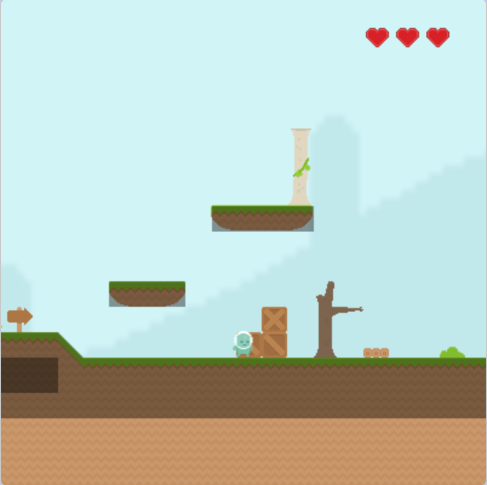
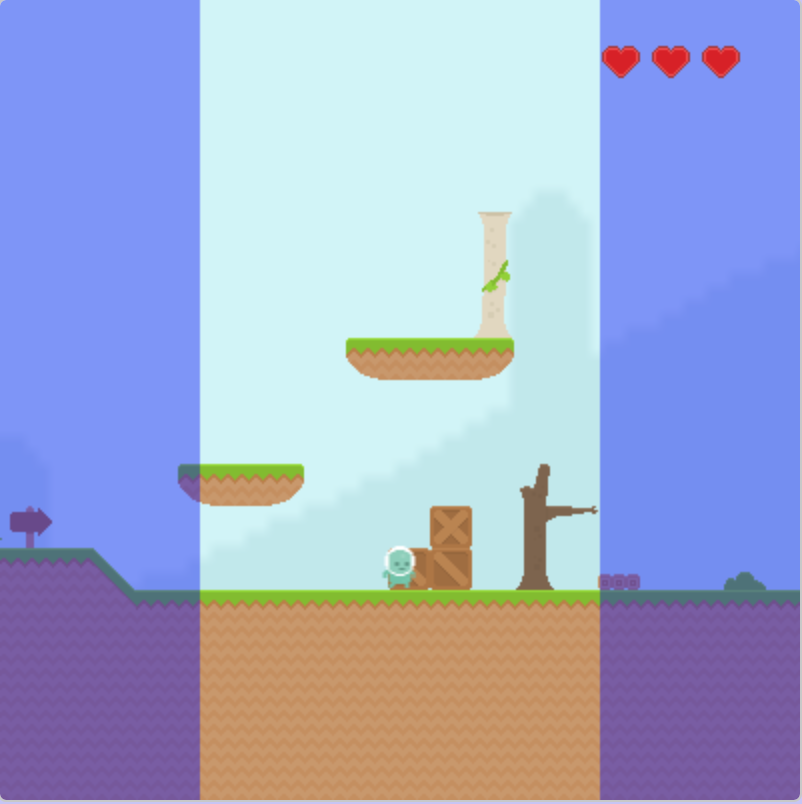

# unit-6-project
### **Table Of Contents**
---
#### 1 [Project Details](#project-details)
##### 1.1 [Level Creation](#level-creation)
##### 1.2 [Hitboxes](#hitboxes)
##### 1.3 [Scrolling](#scrolling)
#### 2 [Reflection](#reflection)
##### 2.1 [Question 1](#q1)
##### 2.1.1 [Response](#r1)
##### 2.2 [Question 2](#q2)
##### 2.2.1 [Response](#r2)
##### 2.3 [Question 3](#q3)
##### 2.3.1 [Response](#r3)
#### 3 [Credits](#credits)
##### 3.1 [License](#license)


---
<a name='project-details'></a>
## Project Details

This project is a simple platformer game created using the `cmu_graphics` python package.

<a name='level-creation'></a>
### Level Creation

The project uses an array to store the level since *CMU Graphics* does not allow more than one python file. The idea behind the sytstem is quite simple. The array consists of a list of tiles which are displayed in their order of arrangement.

For example if we are given an array:

```py
level = [
          [0, 0, 1],
          [1, 0, 1],
          [0, 1, 0],
        ]
```

The scripts analyzes the array and creates the level where each number would correspond to a different tile. The result may look like:

```py
🟩 🟩 🟥
🟥 🟩 🟥
🟩 🟥 🟩
```

Each number is reffered to a link which contains a unquie tile stored on this repository.
<a name='hitboxes'></a>
### Hitboxes

Every object that is interactble by the player, has been added a *Hitbox* manually. The player does not understand the image of the level however, the player can understand the hitboxes creating the illusion that the player is able to interact with the level.



<a name='scrolling'></a>
### Scrolling
The players range of movement is limited in the area shown in blue. By having these 'invisible walls' this allows the player to explore the entire level while being able to have a short view of what is ahead of them.

When the player reaches the end of the level (on either side) the barriers are removed allowing the player to reach the edge of the screen where there is a wall built in.


<a name='reflection'></a>
## Reflection
You will answer the following questions in 150 words or less.  

<a name='q1'></a>
### Question 1
What struggles did you encounter while completing your project and what strategies did you employ to work through them?

<a name='r1'></a>
#### Response

>The biggest struggle I faced when creating this project was creating a life-like physics enginge without the use of any python modules or external scripts. To do this I read up on veloctity, kinematic equations and implemented them in the code after a great amount of trial and error.

<a name='q2'></a>
### Question 2
Did you satisfy all of the criteria listed in the specifications?

<a name='r2'></a>
#### Response
>Yes.
 >- [x] Groups and Group Properties: in the form of levels and player groups.
 >- [x] Group Methods: many Group Methods were used in creating the multitude of groups in the project.
 >- [x] Step Events, Motion and Special Types of Motion: in the form of smooth motion, scrolling motion.

<a name='q3'></a>
### Question 3
Did you give your best effort on this assignment?

<a name='r3'></a>
#### Response
> For the given time limit, I put in my best effort on this assignment. Altough I feel that the level could be a little more challenging and longer I think it is sufficient for the task.

<a name='credits'></a>
## Credits

<a name='level-art'></a>
### Level Art
All the level art and images was created by @kenny, which can be found here: https://www.kenney.nl/assets/platformer-art-pixel-redux

<a name='lic1'></a>
### License

```
License: (CC0 1.0 Universal) You're free to use
these game assets in any project, personal or commercial. There's no need to ask permission
before using these. Giving attribution is not
required, but is greatly appreciated!
```

<a name='music'></a>
### Music

The music for the game is First Steps by
Lena Raine from the Celeste Original Soundtrack which can be found here: https://www.youtube.com/watch?v=N8OHSXvneOE
